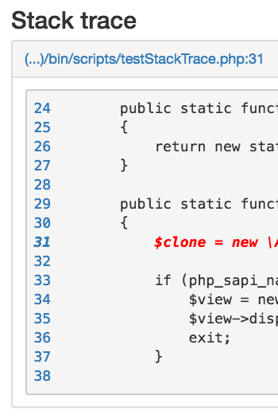

# ErrorDumper

[](https://packagist.org/packages/awesomite/error-dumper)
[](https://packagist.org/packages/awesomite/error-dumper)
[](https://www.codacy.com/app/awesomite/error-dumper?utm_source=github.com&amp;utm_medium=referral&amp;utm_content=awesomite/error-dumper&amp;utm_campaign=Badge_Grade)
[](https://coveralls.io/github/awesomite/error-dumper?branch=master)
[](https://travis-ci.org/awesomite/error-dumper)

Debugger integrated with PhpStorm.
`ErrorDumper` allows you to catch all kinds of errors and exceptions in PHP.
You will be able to serialize, restore and display them later in readable form.
[@See](https://awesomite.github.io/error-dumper/examples/exception.html) example.

## Table of contents

* [Installation](#installation)
* [How to use?](#how-to-use)
  * [Development environment](#development-environment)
  * [Production environment](#production-environment)
  * [Sandbox](#sandbox)
  * [Integration with PhpStorm](#integration-with-phpstorm)
  * [Skipping chosen exceptions](#skipping-chosen-exceptions)
* [Versioning](#versioning)
* [Examples](#examples)
* [Content Security Policy](#content-security-policy)
* [Symfony integration](#symfony-integration)

## Installation

```bash
composer require awesomite/error-dumper
```

## How to use?

### Development environment

```php
<?php

use Awesomite\ErrorDumper\ErrorDumper;

ErrorDumper::createDevHandler()
    ->registerOnError() // errors @see http://php.net/manual/en/function.trigger-error.php
    ->registerOnException() // uncaught exceptions
    ->registerOnShutdown(); // @see http://php.net/manual/en/function.error-get-last.php

// or

ErrorDumper::createDevHandler()->register();
```

### Production environment

#### Register handlers

```php
<?php

use Awesomite\ErrorDumper\Handlers\ErrorHandler;
use Awesomite\ErrorDumper\Serializable\SerializableException;
use Awesomite\ErrorDumper\Listeners\OnExceptionCallable;

$callback = function ($exception) {
    /** @var \Exception|\Throwable $exception */
    $clone = new SerializableException($exception);
    $serialized = serialize($clone);
    // TODO store serialized exception
    // use $clone->getStackTrace()->getId() to count number of occurrences similar errors
    echo '503';
};

$handler = new ErrorHandler();
$handler
    ->pushListener(new OnExceptionCallable($callback))
    ->register();
```

#### Display error in errorlog

```php
<?php

use Awesomite\ErrorDumper\Views\ViewHtml;

$view = new ViewHtml();
// TODO fetch $serialized data from your storage
/** @var string $serialized */
$unserialized = unserialize($serialized);
$view->display($unserialized);
```

### Sandbox

#### Popular case of sandbox usage

```php
<?php

$sandbox->executeSafely(function () {
    /** @var \Twig_Environment $twig */
    $twig->render('template.twig');
});
```

#### Full story

PHP supports one error control operator: the at sign @ 
([@see](http://php.net/manual/en/language.operators.errorcontrol.php)).
Try execute (without custom error handler) the following samples of code:

```php
<?php

trigger_error('Test error');
echo 'OK';
```

Expected output:

```
Notice: Test error
OK
```

```php
<?php

@trigger_error('Test error');
echo 'OK';
```

Expected output:
```
OK
```

Official PHP [documentation](http://php.net/manual/en/language.operators.errorcontrol.php) says:

> If you have set a custom error handler function with set_error_handler() then it will still get called,
but this custom error handler can (and should) call error_reporting()
which will return 0 when the call that triggered the error was preceded by an @.

It means there are two ways depend on your error_reporting settings:

##### error_reporting(E_ALL | E_STRICT)

```php
<?php

error_reporting(E_ALL | E_STRICT);

set_error_handler(function ($code, $message, $file, $line) {
    if ($code & error_reporting()) {
        echo 'ERROR: ' . $message;
        exit;
    }
});

@trigger_error('Test'); // will do nothing
```

##### error_reporting(0)

```php
<?php

error_reporting(0);

set_error_handler(function ($code, $message, $file, $line) {
    echo 'ERROR: ' . $message;
    exit;
});

@trigger_error('Test'); // will display "ERROR: Test" and will stop script
```

If you have `error_reporting(0)` you can need sandbox for errors:

```php
<?php

use Awesomite\ErrorDumper\ErrorDumper;
use Awesomite\ErrorDumper\Handlers\ErrorHandler;

$errorHandler = ErrorDumper::createDevHandler(null, ErrorHandler::POLICY_ALL);
$errorHandler->register();

$sandbox = $errorHandler->getErrorSandbox();
$sandbox->executeSafely(function () {
    trigger_error('test'); // will do nothing
});
```

Instead of `executeSafely` you can use `execute`, which will throw exception in case of error.

```php
<?php

use Awesomite\ErrorDumper\ErrorDumper;
use Awesomite\ErrorDumper\Sandboxes\SandboxException;

$errorHandler = ErrorDumper::createDevHandler();
$errorHandler->register();

try {
    $sandbox = $errorHandler->getErrorSandbox();
    $sandbox->execute(function () {
        trigger_error('test'); // will throw SandboxException
    });
} catch (SandboxException $exception) {
    header('Content-Type: text/plain');
    echo 'Error message: ' . $exception->getMessage() . "\n";
    echo 'Severity: ' . $exception->getSeverity() . "\n";
    echo 'Location in code: ' . $exception->getFile() . ':' . $exception->getLine();
    exit;
}
```

### Integration with PhpStorm

```php
<?php

use Awesomite\ErrorDumper\Views\ViewHtml;
use Awesomite\ErrorDumper\Editors\Phpstorm;
use Awesomite\ErrorDumper\Serializable\SerializableException;

$view = new ViewHtml();
$phpstorm = new Phpstorm();
$view->setEditor($phpstorm);

/** @var \Exception|\Throwable $exception */
$view->display(new SerializableException($exception));
```

`ViewHtml` has method `setEditor`. It allows you to achieve the following effect:



Click on line number and you will be redirected to PhpStorm directly from browser.

### Skipping chosen exceptions

```php
<?php

use Awesomite\ErrorDumper\Handlers\ErrorHandler;
use Awesomite\ErrorDumper\Listeners\PreExceptionCallable;

$handler = new ErrorHandler();
$preListener = new PreExceptionCallable(function ($exception) {
    if ($exception instanceof \RuntimeException) {
        PreExceptionCallable::stopPropagation();
    }
});
$handler->pushPreListener($preListener);
```

## Versioning

The version numbers follow the [Semantic Versioning 2.0.0](http://semver.org/) scheme.

## Examples

To run examples you need at least PHP 5.4.

```bash
composer update --dev
bin/webserver.sh
```

Execute above commands and open in your browser url `http://localhost:8001`.
To run example in terminal, execute `bin/test.php`.

## Content Security Policy

This library uses *.js files hosted on `maxcdn.bootstrapcdn.com` and `code.jquery.com`
(`@see \Awesomite\ErrorDumper\Views\ViewHtml::getResources`).
Add those domains to your `Content-Security-Policy` header during display errors.

## Symfony integration

[Error Dumper Bundle](https://github.com/awesomite/error-dumper-bundle)
