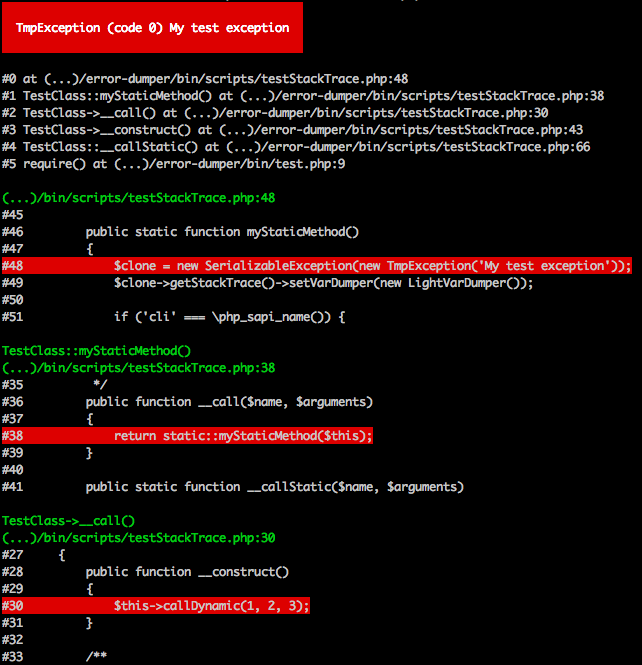

# ErrorDumper

[](https://packagist.org/packages/awesomite/error-dumper)
[](https://packagist.org/packages/awesomite/error-dumper)
[](https://www.codacy.com/app/awesomite/error-dumper?utm_source=github.com&amp;utm_medium=referral&amp;utm_content=awesomite/error-dumper&amp;utm_campaign=Badge_Grade)
[](https://coveralls.io/github/awesomite/error-dumper?branch=master)
[](https://travis-ci.org/awesomite/error-dumper)

Debugger integrated with PhpStorm.
`ErrorDumper` allows you to catch all kinds of errors and exceptions in PHP.
You will be able to serialize, restore and display them later in readable form.
[@See](https://awesomite.github.io/error-dumper/examples/exception.html) example.

## Table of contents

* [Installation](#installation)
* [How to use?](#how-to-use)
* [Screenshots](#screenshots)
  * [HTML](#html)
  * [CLI](#cli)
* [Versioning](#versioning)
* [Examples](#examples)
* [Content Security Policy](#content-security-policy)
* [Symfony integration](#symfony-integration)

## Installation

```bash
composer require awesomite/error-dumper
```

## How to use?

```php
<?php

use Awesomite\ErrorDumper\Handlers\ErrorHandler;
use Awesomite\ErrorDumper\Listeners\OnExceptionDevView;
use Awesomite\ErrorDumper\Views\ViewFactory;

/**
 * Create new error handler
 * If $mode is null will be used default value E_ALL | E_STRICT
 * 
 * @see http://php.net/manual/en/errorfunc.constants.php
 */
$handler = new ErrorHandler(/* optional $mode = null */);

/**
 * Create and push new error listener 
 */
$devViewListener = new OnExceptionDevView(ViewFactory::create());
$handler->pushListener($devViewListener);

/**
 * Register error handler 
 */
$handler->register(/* optional $types = ErrorHandler::TYPE_ALL */);

```

Read [quick start](docs/quick-start.md#quick-start).

## Screenshots

### HTML

<p align="center">
    <a href="docs/resources/exception-html.png">
        
    </a>
</p>

### CLI

<p align="center">
    <a href="docs/resources/exception-cli.png">
        
    </a>
</p>

## Versioning

The version numbers follow the [Semantic Versioning 2.0.0](http://semver.org/) scheme.

## Examples

To run examples you need at least PHP 5.4.

```bash
composer update --dev
bin/webserver.sh
```

Execute above commands and open in your browser url `http://localhost:8001`.
To run example in terminal, execute `bin/test.php`.

## Content Security Policy

This library uses *.js files hosted on `maxcdn.bootstrapcdn.com` and `code.jquery.com`
(`@see \Awesomite\ErrorDumper\Views\ViewHtml::getResources`).
Add those domains to your `Content-Security-Policy` header during display errors.

## Symfony integration

[Error Dumper Bundle](https://github.com/awesomite/error-dumper-bundle)
