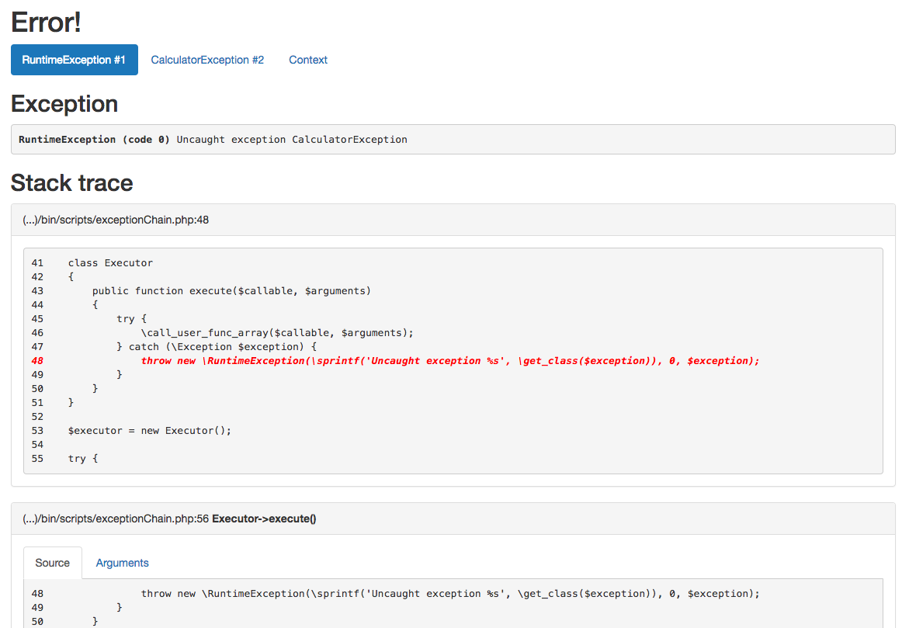
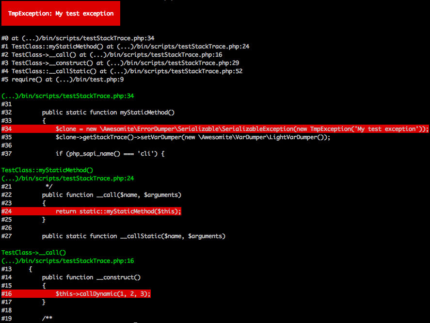

# Error Dumper Documentation

## Quick start

Read [quick-start.md](quick-start.md)

## Error Preview

### HTML

[See example](https://awesomite.github.io/error-dumper/examples/exception.html)



### CLI



## Filtering exceptions by class

Error dumper allows you to define different handlers for different exceptions classes.

```php
<?php

use Awesomite\ErrorDumper\Listeners\OnExceptionCallable;

// ...

$onRuntimeException = function (\RuntimeException $exception) {
    // do something
};

$onErrorException = function (\ErrorException $exception) {
    // do something
};

/** @var \Awesomite\ErrorDumper\Handlers\ErrorHandler $handler */
$handler
    ->pushListener(new OnExceptionCallable($onRuntimeException))
    ->pushListener(new OnExceptionCallable($onErrorException));
```

Read [filtering-exceptions.md](filtering-exceptions.md)
