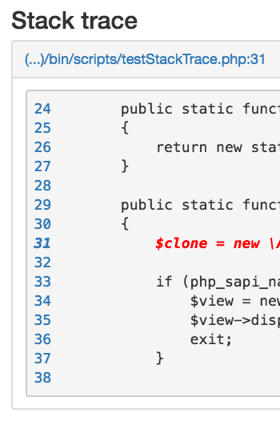

# IDE integration

```php
<?php

use Awesomite\ErrorDumper\Views\ViewHtml;
use Awesomite\ErrorDumper\Editors\Phpstorm;
use Awesomite\ErrorDumper\Serializable\SerializableException;

$view = new ViewHtml();
$phpstorm = new Phpstorm();
$view->setEditor($phpstorm);

/** @var \Exception|\Throwable $exception */
$view->display(new SerializableException($exception));
```

`ViewHtml` has method `setEditor`. It allows you to achieve the following effect:



Click on line number and you will be redirected to PhpStorm directly from browser.
